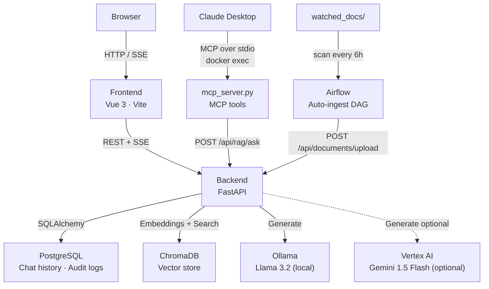

# SecuRAG

> **Enterprise Security Knowledge Base Chatbot** — Ask questions about your internal security policies, compliance guides, and SOPs through a conversational AI interface. All processing runs on your own infrastructure; no data leaves your network.


---

## Demo

*Both clips are narrated and subtitled — sound on, or read the band under the picture.*

### Demo 1 — RAG Knowledge Retrieval

Upload a security document, ask questions, and watch the pipeline run in real time — the three stages that report a timer are the input guardrail check, vector retrieval, and streaming LLM generation. Includes a multi-turn follow-up and a prompt injection attempt — the input guardrail passes it, and the model declines it anyway.

<video src="https://github.com/user-attachments/assets/aad43a41-7fd5-4171-904b-cc918b1ab689" controls width="100%"></video>

### Demo 2 — Claude Desktop MCP Integration

Query the same knowledge base directly from Claude Desktop using the `ask_securag` MCP tool — no copy-pasting, no context switching.

<video src="https://github.com/user-attachments/assets/eb0f6074-9c0f-49ca-8bba-4c1b6e65bcaf" controls width="100%"></video>

---

## What is SecuRAG?

SecuRAG is a self-hosted RAG-based assistant for querying security documentation. Users upload security policies, SOPs, compliance guides, or internal knowledge files, then ask questions in plain language and receive cited answers grounded in the uploaded content.

This is a portfolio project built to demonstrate end-to-end AI application engineering: document ingestion, chunking, embedding, vector search, retrieval filtering, prompt assembly, LLM streaming, source citation, multi-turn conversation, and system integration across FastAPI, PostgreSQL, ChromaDB, Vue 3, Docker Compose, Airflow, and MCP.

It is not positioned as a production-ready enterprise product. Known gaps such as RBAC, document-level permissions, RAG evaluation benchmarks, and citation verification are noted in the Limitations section.

---

## Architecture




---

## How It Works

Every chat message travels through a five-stage pipeline:

```
User query
    │
    ▼
① Input Guardrail (NeMo)
    │  Blocks prompt injection & off-topic requests (fail-closed)
    │
    ▼
② Retrieval (ChromaDB + Sentence-Transformers)
    │  Embeds query → top-K cosine similarity search → distance threshold filter
    │
    ▼
③ Prompt Assembly
    │  Injects conversation history + retrieved chunks into structured prompt
    │
    ▼
④ LLM Generation (Ollama / Vertex AI)
    │  Streams tokens via SSE as they are produced
    │
    ▼
⑤ Output Guardrail (pattern match, post-hoc)
       Scans the finished answer for system-prompt leakage / jailbreak
       confirmations. Runs after the tokens have streamed — it flags and
       audits, it does not intercept
```

The client receives a stream of JSON events (`status`, `token`, `guardrail`, `done`) and renders them progressively — each pipeline stage displays its own timer so users know exactly what the system is doing.

---

## Features

### RAG-Powered Q&A with Source Citations

Answers are generated exclusively from chunks retrieved from your uploaded documents. The LLM is instructed to cite the source file and page number for every claim. If the knowledge base does not contain relevant information the system says so, rather than hallucinating.

Retrieval uses `all-MiniLM-L6-v2` (Sentence-Transformers) for embedding and ChromaDB for vector search. A configurable cosine distance threshold (`SECURAG_RETRIEVAL_DISTANCE_THRESHOLD`, default `0.7`) discards chunks that are too loosely related before they reach the LLM, preventing low-confidence context from degrading answer quality.

### Multi-Turn Conversation Memory

Each chat session maintains a persistent history in PostgreSQL. Before every query the backend loads the last 6 messages (3 user/assistant turns) and prepends them to the prompt:

```
Previous conversation:
User: What is OWASP?
Assistant: OWASP is the Open Web Application Security Project...
---
Context from knowledge base:
[Source: owasp-top10.pdf, Page 4]
...
User question: How many categories does it define?
```

This allows natural follow-up questions — the LLM understands pronouns and references to earlier answers without the user repeating context.

### Real-Time Streaming with Per-Stage Timers

Responses stream token-by-token using Server-Sent Events. Three of the five pipeline stages announce themselves and are timed — prompt assembly is too fast to be worth a row, and the output guardrail runs after the answer has already arrived:

```
✓  Checking input safety...      0.0s
✓  Searching knowledge base...   0.1s
✓  Generating response...       35.1s
```

Timers use server-side Unix timestamps (`ts`) embedded in each `status` SSE event to measure actual stage durations, avoiding the client-side batching problem where all events in a single TCP packet appear to arrive simultaneously.

### Stream Cancellation

A **Stop** button appears while generation is in progress. Clicking it aborts the fetch via `AbortController` on the frontend. The backend records each event before it streams it and writes the partial answer back when the response generator is torn down — whether that arrives as `CancelledError` (a real client disconnect, which is what Starlette raises) or `GeneratorExit`. The write-back is handed to a task of its own, because every `await` inside a cancelled scope re-raises immediately. So the conversation history stays coherent for interrupted messages, and matches what was actually on screen.

Switching conversations mid-answer aborts the request rather than letting it finish into a view that has moved on.

### AI Safety — Three-Layer Model

The system applies safety checks at three points, each scoped to what it can reliably do:

| Layer | What it checks | Mechanism |
|-------|---------------|-----------|
| **Input Guardrail** | User query — blocks prompt injection and off-topic requests | NeMo Guardrails (Colang flows + LLM self-check) |
| **Retrieval Filter** | Retrieved chunks — drops low-relevance context | Cosine distance threshold |
| **Output Guardrail** | LLM response — catches system-prompt leakage and jailbreak confirmations | Pattern matching on high-signal phrases, **after** streaming |

The input guardrail is **fail-closed**: if NeMo throws an exception, or fails to initialise at all, the request is blocked rather than silently allowed through. Only an explicitly disabled rail (`SECURAG_GUARDRAILS_ENABLED=false`) lets traffic past unchecked.

The output guardrail is **detection, not interception**, and the distinction matters: it runs on the finished answer, by which point every token has already been streamed to the client and read. What it produces is a warning in the transcript and an entry in the audit log, not a response the user never saw. Buffering the answer until it could be checked would make it a real gate and would cost the token-by-token streaming this UI is built around — that trade has not been taken.

It uses pattern matching rather than a second LLM call because NeMo's `generate_async` is a response-generation API, not an auditing API — routing an already-generated response through it triggers NeMo's own input rails on the trigger phrase, producing false positives on legitimate answers.

### Document Management

Upload PDF, TXT, or Markdown files through the Documents view. Each document is processed asynchronously:

1. **Parsing** — PDF text is extracted page-by-page; Markdown and plain text are read directly
2. **Chunking** — Split into overlapping chunks (LangChain `RecursiveCharacterTextSplitter`)
3. **Embedding** — Each chunk is embedded with `all-MiniLM-L6-v2`
4. **Indexing** — Embeddings stored in ChromaDB with metadata (filename, page number, chunk index)

Document status transitions: `processing` → `ready` (or `error`). The UI polls for status changes. Documents can be deleted, which removes both the database record and all associated vectors from ChromaDB.

### Switchable LLM Backend

The `LLMProvider` abstraction allows swapping between backends with a single environment variable:

| Provider | Model | Use case |
|----------|-------|----------|
| `ollama` (default) | Llama 3.2 (local) | Air-gapped / fully private deployment |
| `vertexai` | Gemini 1.5 Flash | Cloud deployment, higher quality |

Both providers implement the same `generate_stream` interface so the rest of the pipeline is unaffected by the choice.

### Airflow Auto-Ingest Pipeline

SecuRAG ships with an Apache Airflow DAG (`securag_auto_ingest`) that automates document ingestion from a watched folder. Drop any PDF, TXT, or Markdown file into `watched_docs/` and it will be indexed into the knowledge base automatically — no UI interaction required.

The DAG runs on a 6-hour schedule and executes two tasks in sequence:

| Task | What it does |
|------|-------------|
| `scan_watch_folder` | Queries `/api/documents` for already-ingested filenames, scans `watched_docs/`, computes the diff |
| `ingest_new_files` | Uploads each new file to `/api/documents/upload`; fails the task if any upload errors, triggering Airflow's retry logic |

Task outputs are passed between stages via **XCom** (Airflow's inter-task communication mechanism). Failed ingestions retry once after 5 minutes.

The Airflow web UI is available at **http://localhost:8313** (admin / admin). DAGs can also be triggered manually from the UI without waiting for the next scheduled run.

### MCP Server — Claude Desktop Integration

SecuRAG exposes its knowledge base as **Model Context Protocol (MCP)** tools, allowing Claude Desktop to query your documents directly during a conversation without copy-pasting content.

Three tools are registered:

| Tool | Description |
|------|-------------|
| `list_documents` | Lists all documents currently in the knowledge base |
| `search_knowledge_base` | Semantic search — returns the most relevant raw chunks for a query |
| `ask_securag` | Full RAG pipeline — retrieves context and generates a cited answer via the local LLM |

The MCP server runs inside the existing backend Docker container (Python 3.11 + all dependencies already present). Claude Desktop communicates with it via `docker exec`.

**Setup:** add the following to `~/Library/Application Support/Claude/claude_desktop_config.json`, then restart Claude Desktop:

```json
{
  "mcpServers": {
    "securag": {
      "command": "docker",
      "args": ["exec", "-i", "securag-backend-1", "python", "/app/mcp_server.py"]
    }
  }
}
```

SecuRAG services must be running (`make up`) before starting Claude Desktop.

### Audit Trail

Every significant event is written to the `audit_logs` table with timestamp, event type, detail payload, and client IP:

- `query` — a question was asked
- `search` — the knowledge base was searched without generating an answer
- `upload` — document uploaded and indexed
- `delete_document` — document removed
- `guardrail_block` — input was blocked by the input rail, before the model ran
- `guardrail_flag` — output tripped the output filter after it had been streamed

Both front ends are covered. Events raised by the non-streaming endpoints the MCP server calls (`/api/rag/ask`, `/api/rag/search`) carry `"source": "rag_api"` in their detail payload, so questions asked from Claude Desktop can be told apart from questions asked in the browser.

Indexed on `event_type` and `created_at` for efficient compliance reporting queries.

---

## What This Project Demonstrates

This project is intended as an engineering portfolio piece, not a commercial product. It demonstrates the ability to build and integrate a complete AI-powered system:

- **RAG pipeline implementation** — document parsing, chunking strategy, embedding, vector search, distance threshold filtering, prompt assembly, citation metadata, and no-answer handling when retrieval confidence is low
- **Backend system integration** — FastAPI service with PostgreSQL (chat history, audit logs), ChromaDB (vector store), and Ollama/Vertex AI (LLM) running together under Docker Compose
- **Frontend engineering** — Vue 3 chat interface with SSE streaming, per-stage pipeline timers, generation cancellation via AbortController, and document management
- **Security-aware design** — local LLM deployment for data privacy, NeMo Guardrails for input validation, output pattern matching, and PostgreSQL audit logging
- **System extensibility** — Airflow DAG for scheduled document auto-ingestion, MCP server exposing RAG tools to Claude Desktop and other agent frameworks, pluggable LLM backend (Ollama ↔ Vertex AI) via a common interface

---

## Current Limitations

The following are known gaps that would need to be addressed before production deployment:

- **No RBAC or document-level permissions** — all authenticated users share the same knowledge base; per-user or per-role document access is not implemented
- **No RAG evaluation benchmark** — retrieval quality and answer faithfulness are not measured systematically; adding RAGAS or a similar framework would make quality regressions detectable
- **Citation verification** — the LLM is instructed to cite sources but there is no programmatic check that cited chunks actually support the generated claims
- **Direct prompt injection is not reliably blocked** — the input guardrail is an LLM self-check against Colang flows, and it passes phrasings those flows do not cover. The first demo above shows one: all three pipeline stages run, so the request reached the model and was declined there rather than at the rail. A model that refuses is a second layer, not a substitute for the first, and nothing here measures how much the rails actually catch — a labelled set of injection attempts scored against them is the missing piece
- **Document prompt-injection defense** — malicious content embedded in uploaded documents (e.g. instructions hidden in a PDF) is not sanitized before being injected into the prompt context
- **No document governance** — there is no versioning, approval workflow, or access-controlled upload; any user can add or delete documents
- **The stack is a development configuration** — the frontend container runs the Vite dev server with hot reload rather than a built bundle behind a static server, and no service is fronted by TLS or a reverse proxy. `make up` is for running this on one machine, not for deploying it

---

## Tech Stack

| Layer | Technology | Notes |
|-------|-----------|-------|
| Frontend | Vue 3, Naive UI | Composition API, `<script setup>` |
| Backend | FastAPI, SQLAlchemy 2.0 async | Async throughout; Alembic for migrations |
| Embeddings | Sentence-Transformers `all-MiniLM-L6-v2` | Runs in-process, no GPU required |
| Vector Store | ChromaDB | Persistent local volume |
| LLM | Ollama (Llama 3.2) / GCP Vertex AI | Swappable via env var |
| Safety | NVIDIA NeMo Guardrails | Colang flows + LLM self-check |
| Database | PostgreSQL 16 | Chat history, documents, audit logs |
| Pipeline Orchestration | Apache Airflow 2.9 | Scheduled auto-ingest from watched folder |
| AI Integration | MCP (Model Context Protocol) | Exposes knowledge base as Claude Desktop tools |
| Deployment | Docker Compose | Single `make up` to start everything; development configuration only — see Limitations |

---

## Getting Started

### Prerequisites

- [Docker Desktop](https://www.docker.com/products/docker-desktop/) 4.0+
- [Ollama](https://ollama.com) running on the host (`ollama serve`, port 11434) — SecuRAG connects
  to it via `host.docker.internal` rather than running its own container, so the model is shared
  with anything else on the machine that uses Ollama
- ~4 GB free disk space (Llama 3.2 model)

### Quick Start

```bash
git clone https://github.com/lin891020/SecuRAG.git
cd SecuRAG

cp .env.example .env   # review defaults, no edits required for local use

make build             # build Docker images (~5 min first time)
make up                # start all services
make pull-model        # download Llama 3.2 into the host Ollama (~2 GB, first time only)
make ps                # verify all containers are running
```

The backend applies database migrations on startup and refuses to start if they
fail, so a backend that is up has a schema at `head`. To apply them by hand
against a running stack — after pulling a change that adds a migration, say —
use `make migrate`.

Open **http://localhost:8311** in your browser.

### First Steps

1. Go to **Documents** → upload one or more PDF/TXT/Markdown files
2. Wait for status to show `ready` (embedding runs in the background)
3. Go to **Chat** → ask a question about the uploaded content
4. The AI responds with cited sources; ask follow-up questions naturally

---

## Configuration

All settings are environment variables in `.env`. The full list is in [`.env.example`](.env.example).

### Core Settings

```bash
# LLM backend: "ollama" (default, fully local) or "vertexai"
SECURAG_LLM_PROVIDER=ollama

# Cosine distance cutoff for retrieval (0 = perfect match, 1 = unrelated)
# Raise this to be more permissive; lower it to require tighter relevance
SECURAG_RETRIEVAL_DISTANCE_THRESHOLD=0.7

# NeMo Guardrails on/off
SECURAG_GUARDRAILS_ENABLED=true
```

### Switching to Vertex AI

```bash
SECURAG_LLM_PROVIDER=vertexai
SECURAG_GCP_PROJECT=your-project-id
SECURAG_GCP_REGION=us-central1
SECURAG_VERTEXAI_MODEL=gemini-1.5-flash
```

Ensure `GOOGLE_APPLICATION_CREDENTIALS` or Application Default Credentials are configured in the backend container.

---

## Development

### Running Tests

```bash
make test
# or directly:
docker compose exec backend python -m pytest tests/ -v
```

The test suite covers API endpoints, RAG pipeline, guardrails service, LLM providers, and utilities — **122 tests, 0 failures**. It mocks Postgres, ChromaDB and the LLM, so `make test` needs the backend image but not a running stack.

### Project Structure

```
SecuRAG/
├── backend/
│   ├── app/
│   │   ├── api/              # Route handlers: chat.py, documents.py, health.py, rag.py
│   │   ├── guardrails/       # NeMo guard wrapper + Colang config
│   │   │   └── config/       # config.yml, rails.co, prompts.yml
│   │   ├── llm/              # LLMProvider base class, Ollama + VertexAI impls
│   │   ├── models/           # SQLAlchemy ORM: ChatSession, ChatMessage, Document, AuditLog
│   │   ├── rag/              # Embedder, splitter, ChromaDB retriever
│   │   ├── schemas/          # Pydantic request/response models
│   │   ├── services/         # rag_pipeline.py (SSE orchestration), audit_service.py
│   │   └── utils/            # constants.py (SSE/doc status), request.py (get_client_ip), sse.py (parse_sse_event — used by api/chat.py and api/rag.py to read back their own stream), file parsers
│   ├── mcp_server.py         # MCP server — exposes RAG tools to Claude Desktop
│   ├── alembic/              # DB migrations (001 initial schema, 002 indexes)
│   ├── tests/                # pytest — one file per module
│   └── pyproject.toml
├── dags/
│   └── securag_auto_ingest.py  # Airflow DAG: scan watched_docs/ every 6h and ingest
├── watched_docs/             # Drop files here for automatic ingestion
├── frontend/
│   ├── src/
│   │   ├── views/            # ChatView.vue, DocumentsView.vue, SettingsView.vue
│   │   ├── utils/            # api.ts (shared fetch helpers + API constants), format.ts (formatSize)
│   │   ├── router/           # Vue Router
│   │   └── styles/           # Global CSS
│   └── package.json
├── docker/
│   ├── airflow/              # init.sh: db migrate + create admin user
│   ├── ollama/               # Legacy model-pull script (Ollama now runs on the host)
│   └── postgres/             # init.sql
├── docker-compose.yml
├── Makefile
└── .env.example
```

### Makefile Reference

| Command | Description |
|---------|-------------|
| `make up` | Start all services (detached) |
| `make down` | Stop and remove containers |
| `make build` | Rebuild Docker images |
| `make logs` | Tail logs from all services |
| `make pull-model` | Pull Llama 3.2 into the host Ollama |
| `make migrate` | Run pending Alembic migrations |
| `make airflow-setup` | Create Airflow metadata DB and run initial migrations (run once) |
| `make test` | Run the backend test suite |
| `make ps` | Show container status |
| `make restart service=<name>` | Restart one service |
| `make shell-backend` | Open a shell in the backend container |
| `make shell-frontend` | Open a shell in the frontend container |

---

## API Reference

### Endpoints

| Method | Path | Description |
|--------|------|-------------|
| `GET` | `/api/health` | Liveness check — returns service status for all components |
| `POST` | `/api/chat` | Send a message; returns an SSE stream |
| `GET` | `/api/chat/sessions` | List the 50 most recent chat sessions |
| `GET` | `/api/chat/sessions/{id}/messages` | All messages in a session (chronological) |
| `PATCH` | `/api/chat/sessions/{id}` | Rename a session |
| `DELETE` | `/api/chat/sessions/{id}` | Delete session and all its messages |
| `GET` | `/api/documents` | List all documents with status |
| `POST` | `/api/documents/upload` | Upload and index a document (multipart/form-data) |
| `DELETE` | `/api/documents/{id}` | Delete document and remove its vectors |
| `POST` | `/api/rag/search` | Semantic search — returns raw chunks without LLM generation |
| `POST` | `/api/rag/ask` | Full RAG query — non-streaming, returns complete answer (used by MCP) |

Interactive docs available at **http://localhost:8310/docs**.

### SSE Event Stream (`POST /api/chat`)

Each `data:` line in the stream is a JSON object. The sequence for a normal response:

```
data: {"type": "status",   "label": "Checking input safety...",   "ts": 1714000000.1}
data: {"type": "status",   "label": "Searching knowledge base...", "ts": 1714000000.2}
data: {"type": "status",   "label": "Generating response...",      "ts": 1714000000.3}
data: {"type": "token",    "content": "Incident"}
data: {"type": "token",    "content": " response"}
...
data: {"type": "done",     "sources": [...], "ts": 1714000035.4}
```

If the input guardrail blocks the request, no tokens are sent at all:

```
data: {"type": "status",   "label": "Checking input safety...", "ts": ...}
data: {"type": "guardrail","stage": "input", "content": "Request blocked by policy."}
data: {"type": "done",     "sources": [], "blocked": true}
```

If the output guardrail flags an answer, that answer has already been streamed. The event arrives after the tokens and annotates them; it does not retract them:

```
data: {"type": "token",    "content": "..."}
data: {"type": "guardrail","stage": "output", "content": "This response was flagged by the output filter after it was sent."}
data: {"type": "done",     "sources": [...], "ts": ...}
```

| Field | Type | Description |
|-------|------|-------------|
| `type` | string | `status` \| `token` \| `guardrail` \| `done` |
| `stage` | string | `input` \| `output` — which rail raised a `guardrail` event, and therefore whether the message replaces the answer or annotates it |
| `content` | string | Token text, block reason, or output-filter notice |
| `label` | string | Human-readable stage name (status events) |
| `ts` | float | Unix timestamp (status and done events) |
| `sources` | array | Source citations — `filename`, `page_number`, `content_preview` |
| `blocked` | bool | Present and `true` on done event when guardrail triggered |

---

## Troubleshooting

**Documents not found after restarting containers**  
ChromaDB persists data to `/data` inside its container. Ensure your `docker-compose.yml` mounts the volume at that exact path: `chroma_data:/data`. A mismatch causes data to be written to a non-persistent path and lost on restart.

**"This response was flagged by the output filter after it was sent" on normal questions**  
The output guardrail uses pattern matching for high-signal phrases only (system prompt leakage, jailbreak confirmations). If you see false positives, adjust the regex patterns in the output guardrail, or relax the conditions in `backend/app/guardrails/config/rails.co`. The issue is overly strict pattern matching, not a NeMo initialization failure.

**LLM responses are very slow**  
Llama 3.2 on CPU can take 30–60 seconds per response. This is expected without a GPU. Switch to `SECURAG_LLM_PROVIDER=vertexai` for faster cloud inference, or run the stack on a machine with an Nvidia GPU and configure Ollama to use it.

**Guardrails blocking legitimate security questions**  
Adjust the Colang flows in `backend/app/guardrails/config/rails.co`. Add canonical examples to `define user ask about security` to help NeMo classify similar queries as allowed.

---

## License

MIT
